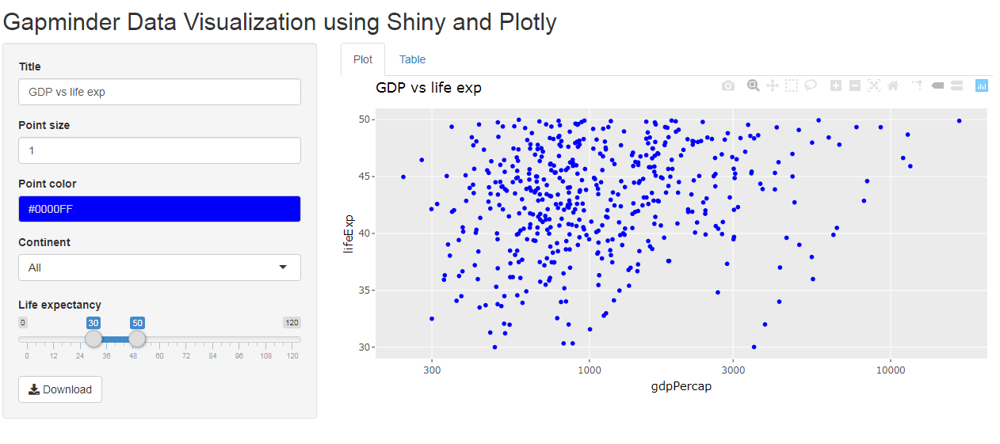

## Introduction

This presentation is part of the Developing Data Products Coursera.org course project submission.

It is an R Presentation generated with RStudio.

The Shiny application pitched by this presentation is at 
https://yashyu2409.shinyapps.io/Shiny_App_and_Reproducible_Research/

The Shiny app source code is available at https://github.com/yashyu24/Shiny-app/tree/master/Shiny_App_and_Reproducible_Research

## Application Overview

- The application is written in Shiny which is a web application framework for R
- The source code consists of two files: server.R and ui.R
- server.R includes the the server logic of a Shiny web application
- ui.R includes the the user-interface definition, which uses the sidebarLayout template
- The application is hosted on Rstudio's shiny server in the cloud (Shinyapps.io)

## How it works? - I | The Application contains: Left Panel

- Label the main titel using a textInput
- Change/determine the size of the plot points using a numericInput
- Add a line of best fit using a checkboxInput
- Change/determine the color of the plot points using a colourInput
- Select data options using selectInput and sliderInput
- download filtered data using a downloadButton

## How it works? - II | The Application contains: Main Panel

There are two tabs in main panel as below:

- Plot: This displays plot for corresponding dataframe
- Table: This displays a searchable-interactive Table for corresponding dataframe

## Ready to give it a try?

Use the Shiny app at https://yashyu2409.shinyapps.io/Shiny_App_and_Reproducible_Research/

Get the app source code at https://github.com/yashyu24/Shiny-app/tree/master/Shiny_App_and_Reproducible_Research

